# API con Test Driven Development en Laravel

[Clase 1 ¿Qué es Laravel?](#Clase-1-¿Qué-es-Laravel?)

[Clase No 2 Herramientas necesarias para trabajar con PHP y Laravel](#Clase-No-2-Herramientas-necesarias-para-trabajar-con-PHP-y-Laravel)

[Clase 3 Entendiendo el ciclo de vida de las solicitudes web](#Clase-3-Entendiendo-el-ciclo-de-vida-de-las-solicitudes-web)

[]()

[]()

[]()

[]()

[]()

[]()

[]()

[]()

[]()

[]()

[]()

[]()

[]()

[]()

[]()

[]()

[]()

[]()

## Clase 1 ¿Qué es Laravel?

Laravel es una herramienta de desarrollo web construida en PHP que permite realizar paginas web, APIS, etc. 

Laravel tambien es un framework que entrega una serie de capas para elaborar paginas web con los requisitos que pueda entregar un cliente, este ya entrega un sistema de login incluyendo redes sociales y otras herramientas que permiten hacer el desarrollo mas facil, entre esos esta la conexion con bases de datos y el manejo de rutas que tiene que ver con el modelo **MVC(Model View Controller)**.

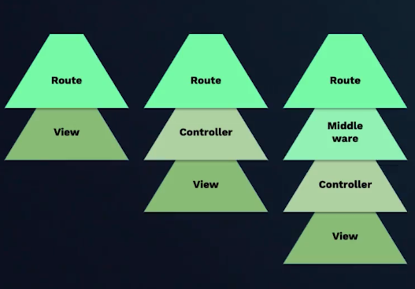

- La primer capa indica que al ingresar a una ruta en el navegador nos va a proporcionar una vista

- La segunda capa indica que la ruta va hacia una logica de programacion y esa logica devuelve una vista

- La tercer capa indica que la ruta va hacia un sistema de seguridad o login con una serie de condiciones que deben estar aprobadas, despues pasa hacia la logica de programacion y por ultimo pasa a la vista.

El primer proyecto va a ser crear un CRUD(Create, Read, Update, Delete) que permite crear un usuario con nombre, correo, contraseña y permite eliminarlo de la base de datos cuando se requiera.

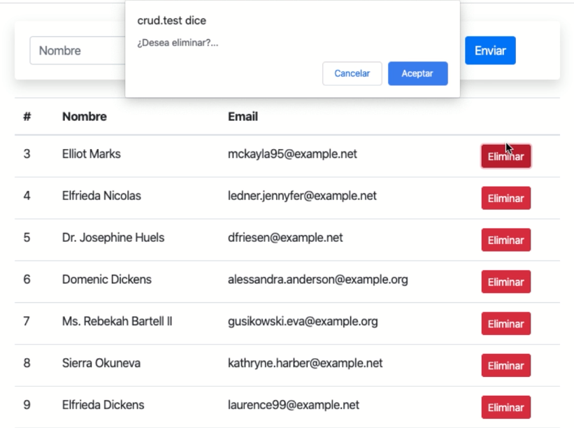

El segundo proyecto es un registro de post que permite tener diferentes contenido multimedia como un podcast, contenido, video y multimedia en general 

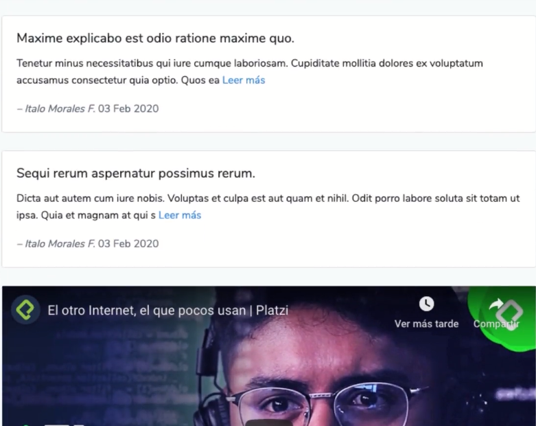

El tercer proyecto es desarrollar una API el cual es un codigo preparado en el servidor para que cualquier dispositivo se pueda conectar al sistema y pueda a partir de alli consumir los datos.

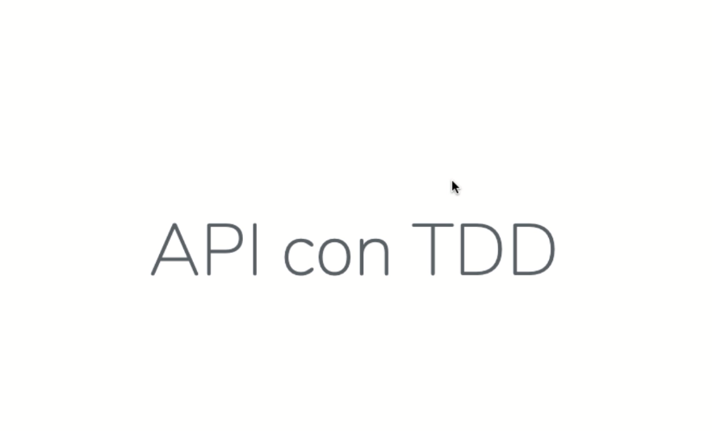

## Clase No 2 Herramientas necesarias para trabajar con PHP y Laravel

**Requisitos**
___

Para trabajar con PHP necesitamos convertir a nuestro equipo en un servidor web, esto se debe a PHP es un lenguaje del lado del servidor a diferencia de Javascript que es del lado del cliente y funciona bien solo con el navegador.

Del lado del servidor significa que consiste en el procesamiento de una petición de usuario en una computadora llamada servidor web, esta petición se procesa y luego genera páginas en HTML con la respuesta deseada.

**Servidor HTTP**
___

Un servidor web o servidor HTTP es básicamente un programa que se instala en una computadora con el fin de procesar un sistema web, con este programa la computadora queda preparada para recibir peticiones de usuario generando respuestas a clientes. Cuando escribes en el navegador [platzi.com](https://platzi.com) y presionas enter se busca en Internet la computadora con este nombre y al encontrarla el servidor procesa, entiende lo que necesitas y retorna la respuesta "la página home de platzi".

Para crear un proyecto o programa web necesitamos simular que nuestro computador es un servidor web y lo logramos instalando un programa, en este caso sería Apache o Nginx.

**PHP**
___
Es el lenguaje de programación que usaremos en el curso y necesitamos instalarlo para que nuestro Servidor HTTP interprete correctamente nuestro código. Básicamente vamos a escribir en PHP así que instalamos el idioma PHP en nuestro equipo.

**Base de Datos**
___

Necesitamos instalar en nuestro equipo la base de datos que usaremos en el curso, esta puede ser MySql o MariaDB. Ambas funcionarían muy bien porque se entienden perfectamente con PHP.

**Software de Instalación**
___

En resumen necesitamos convertir a nuestro equipo en un servidor web, para ellos básicamente instalamos:

-**Servidor web:** Apache o Nginx.

-**Lenguaje:** PHP.

-**Base de datos:** MySql o MariaDB.

Hay varias opciones, yo te recomiendo instalar las mas sencillas porque nuestro enfoque es la programación no la administración de servidores y estos conceptos hay que entenderlos bien, sin darnos cuenta estamos haciendo de nuestro computador un servidor web y un servidor de base de datos.

1. **XAMPP:** https://www.apachefriends.org/es/download.html.

2. **MAMP:** https://www.mamp.info/en/downloads/.

3. **En Mac** Usando brew en Mac podrías instalar valet y por separado a PHP y MySql. El tutorial completo está en la doc de Laravel https://laravel.com/docs/6.x/valet básicamente sería:

    - `brew update`.

    - `brew install php`.

    - `brew install mysql`.

    - `composer global require laravel/valet`.
    
    - Por último `valet install`.

4. También existe la opción de usar Homestead, esto es más avanzado y requiere una configuración mayor, aquí la doc https://laravel.com/docs/6.x/homestead

**Herramientas Importantes**
___

El método de instalación de Laravel es a través de composer, un gestor de paquetes PHP que provee todo lo que necesitemos respecto a este lenguaje. Puedes instalarlo desde este enlace https://getcomposer.org/download/

También es muy importante contar con Git, este es nuestro control de versiones de nuestro software y lo podemos instalar desde su web https://git-scm.com/downloads

Para escribir código necesitaremos a Sublime Text, Visual Studio Code o el editor que prefieras, en el curso usaremos a Visual Studio Code. Y para observar el resultado podemos usar a cualquier navegador web, yo usaré Google Chrome.

**Resumen**
___

Necesitamos el software necesario para convertir nuestro computador en un servidor web, en resumen necesitamos:

1. Lenguaje: PHP >= 7.2.0.

2. Servidor: Apache, Nginx.

3. Base de datos: MySql, MariaDB.

4. Composer.

5. Git.

6. Editor de código.

7. Navegador.


**Usas Mac y solo debes actualizar**
___
Laravel siempre nos obligará a estar actualizado, te comparto este enlace: https://rimorsoft.com/actualizar-a-php-7-3-x-con-homebrew-en-mac, te ayudará mucho si usas Mac.

## Clase 3 Entendiendo el ciclo de vida de las solicitudes web

Es importante entender el ciclo de vida de una solicitud, en este caso se requiere saber que sucede cuando se establece el nombre de una pagina web en el navegador y luego se oprime Enter. Para entender claramente hay que hacer la instalacion de laravel.
___

Para hacer que funcione laravel correctamente se recomienda seguir la guia a continuacion.

Para usuarios windows y linux hay una opcion recomendable que es realizar la instalacion de los siguientes programas

1. [VirtualBox](https://www.virtualbox.org/wiki/Downloads)

este primero proporciona todas las opciones para instalar en los diferentes sistemas operativos

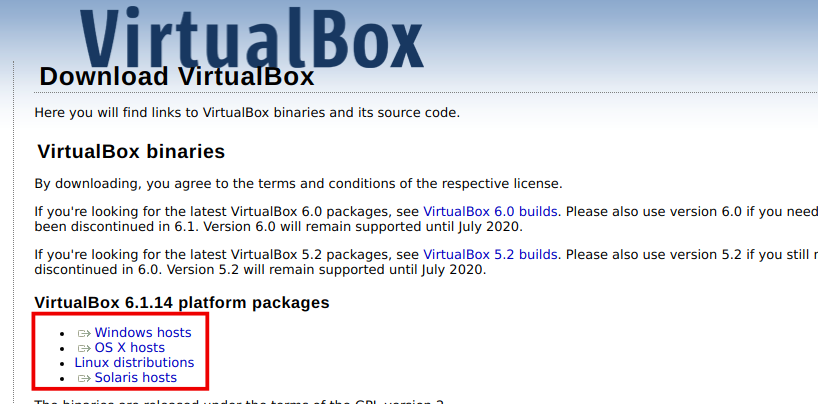

2. [Git](https://git-scm.com/downloads)

3. [Vagrant](https://www.vagrantup.com/downloads)

Despues de realizar la instalacion confirmar en consola que este instalado Virtual Box

`vboxmanage --version`

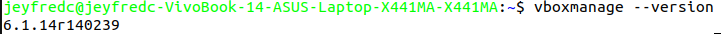

En el caso de windows es recomendable ver este [enlace](https://youtu.be/l9iOi4UGtCE) para que reconozca la version instalada de Virtual Box la cual debe ser la ultima version

para comprobar que vagrant tambien este instalado ejecutar

`vagrant --version`

al igual que el anterior debe traer la ultima version

3. Homestead

Para hacer la instalacion de Homestead en el caso de windows abrir git bash y ejecutar en consola, en el caso de linux solo realizar la instalacion en consola 

`vagrant box add laravel/homestead`

luego cargar la opcion 2) o la que diga que es virtualbox 

**Nota:** la instalacion de este demora

A continuacion ejecutar en consola para linux

`git clone https://github.com/laravel/homestead.git ~/Homestead`

ejecutar en consola para windows

`git clone https://github.com/laravel/homestead.git Homestead`

lo siguiente que se debe hacer es dirigir al folder creado Homestead

en el ejemplo con pwd muestro que estoy en **/home/jeyfredc**

despues con el comando cd Homestead abro el folder

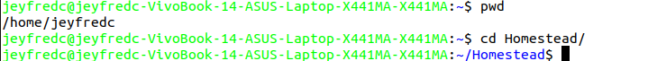

posteriormente se debe inicializar Homestead, ejecutar

`bash init.sh`

debe aparecer un mensaje que diga **Homestead initialized!**

A continuacion como se puede observar la carpeta Homestead tiene varios directorios creados entre estos hay uno que se llama **Homestead.yaml** 

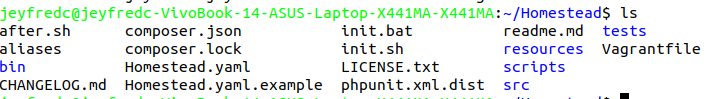

este archivo se puede abrir a traves de un editor de texto o directamente en la consola con vim o nano

el archivo indica que debe tener configurado una clave publica y privada 

```
authorize: ~/.ssh/id_rsa.pub

keys:
    - ~/.ssh/id_rsa
```

si estas claves no estan configuradas aun, es recomendable ver este [video](https://platzi.com/clases/1557-git-github/19950-configurar-llaves-ssh-en-github/) o el siguiente [video](https://youtu.be/PuCdTAayogg)

por defecto el archivo tambien indica que debe haber una carpeta creada llamada code pero esta no esta configurada aun

```
folders:
    - map: ~/code
      to: /home/vagrant/code
```

para crearla solo hay que crear un folder en el home con mkdir code o crear un folder llamado code en el home

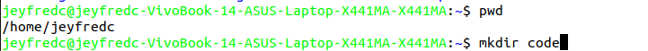

Finalmente en `sites` del archivo **Homestead.yaml** queda de la siguiente forma teniendo en cuenta que la url que se va a abrir en el navegador es **ciclo.test**

```
sites:
    - map: ciclo.test
      to: /home/vagrant/code/ciclo/public
```

Nuevamente ingresar a la carpeta Homestead en la terminal y ejecutar 

`vagrant up`

despues de esperar y iniciar virtualbox ejecutar

`vagrant ssh`

para cerrar la conexion solo escribir `exit`

Despues de esto ejecutar `vagrant suspend` para que la proxima vez que se inicie se pueda ejecutar de una manera mas rapida

___

para ejecutar en linux e iniciar laravel hay 2 opciones para crear el proyecto en la terminal.

pero para usar cualquier de las 2 opciones primero debe estar instalado [composer](https://getcomposer.org/download/) globalmente, para usuarios windows se recomienda reiniciar y agregar la variable de entorno al sistema de windows recomendable seguir el [video](https://youtu.be/Wa1cG8kITqc)

Lo que sigue es realizar la instalacion de [laravel](https://laravel.com/docs/8.x) para eso se ejecuta en la terminal 

`composer global require laravel/installer`

ejecutando el comando `laravel` se despliega la informacion de la configuracion e indica que ya esta instalado laravel

En caso que no arroje nada 

se debe ejecutar

`nano ~/.bashrc`

Esto abre el archivo `.bashrc`

alli debemos copiar lo siguiente 

`alias laravel='~/.config/composer/vendor/bin/laravel`

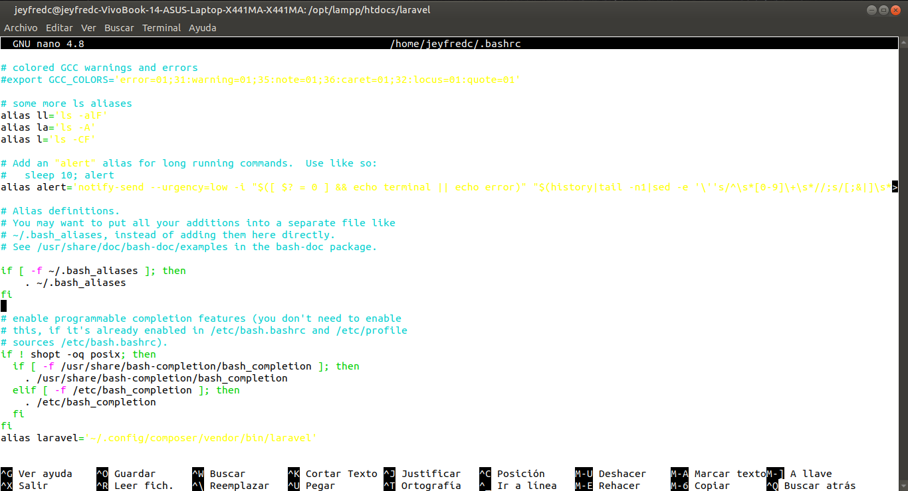

Luego con **Ctrl + O** se guardan cambios, dar Enter y con **Ctrl + X** sale del archivo

por ultimo en la terminal se ejecuta 

`source ~/.bashrc`

posteriormente escribir

`laravel`

y debe salir las opciones de configuracion

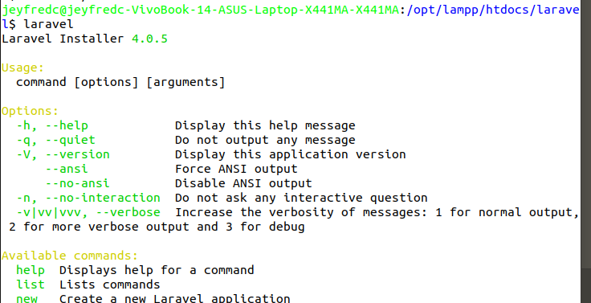

y para crear el proyecto se debe abrir el folder **Homestead** a traves de la terminal 

ejecutar nuevamente 

`vagrant up`

despues

`vagrant ssh`

Se debe configurar el host para que se pueda ejecutar **ciclo.test** en el navegador 

en la terminal ejecutar 

`sudo nano /etc/hosts`

proporcionar la contraseña y agregar el host que esta configurado en **Homestead.yaml** para el caso el del proyecto `192.168.10.10   ciclo.test`

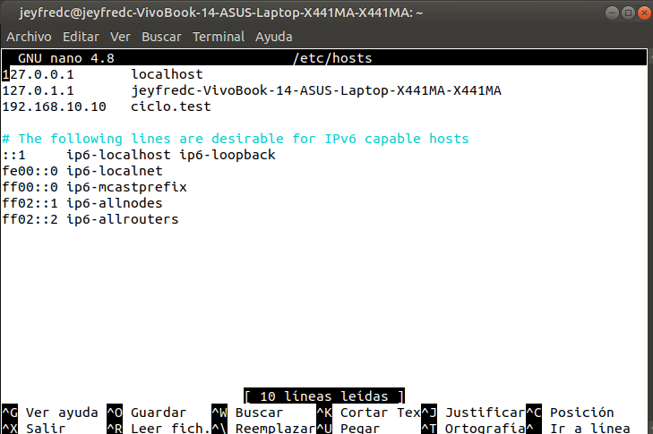

guardar con **Ctrl + O** presionar **Enter** y luego salir con **Ctrl + X**, los usuarios de windows seguir con el video recomendado anteriormente

Despues de realizar esto ejecutar 

`laravel new ciclo`

esperar que instalen las dependencias 

La segunda forma de instalar seria mediante composer con el siguiente comando 

`composer create-project --prefer-dist laravel/laravel ciclo`

dirigirse al navegador y escribir http://ciclo.test/

en caso que indique **No input file specified.**

abrir en la terminal puede ser en otra donde no este funcionando `vagrant ssh`

ubicar nuevamente la carpeta **Homestead** y ejecutar 

`vagrant reload --provision`

despues de cargar todas las dependencias y reconozca el host ya deberia aparecer una pagina como la siguiente 

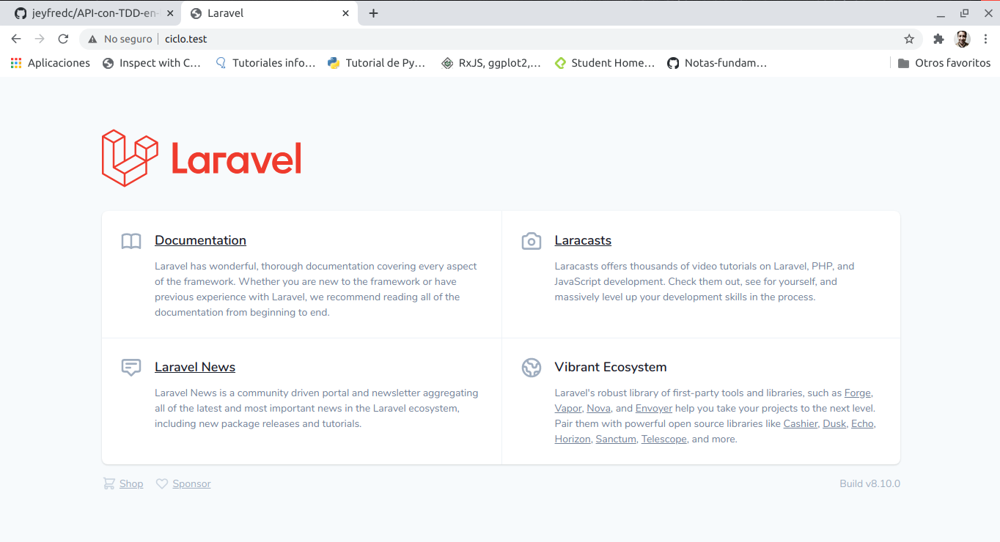