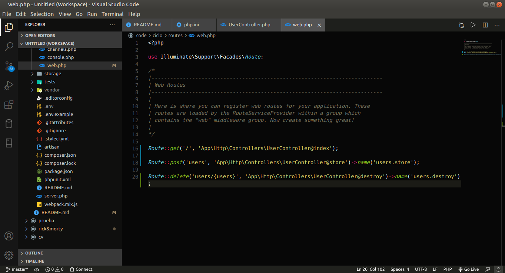

# API con Test Driven Development en Laravel

[Clase 1 ¿Qué es Laravel?](#Clase-1-¿Qué-es-Laravel?)

[Clase No 2 Herramientas necesarias para trabajar con PHP y Laravel](#Clase-No-2-Herramientas-necesarias-para-trabajar-con-PHP-y-Laravel)

[Clase 3 Entendiendo el ciclo de vida de las solicitudes web](#Clase-3-Entendiendo-el-ciclo-de-vida-de-las-solicitudes-web)

[Clase 4 Qué es un CRUD y cómo implementarlo](#Clase-4-Qué-es-un-CRUD-y-cómo-implementarlo)

[Clase 5 Lógica de controladores y vistas con datos de prueba](#Clase-5-Lógica-de-controladores-y-vistas-con-datos-de-prueba)

[]()

[]()

[]()

[]()

[]()

[]()

[]()

[]()

[]()

[]()

[]()

[]()

[]()

[]()

[]()

[]()

## Clase 1 ¿Qué es Laravel?

Laravel es una herramienta de desarrollo web construida en PHP que permite realizar paginas web, APIS, etc. 

Laravel tambien es un framework que entrega una serie de capas para elaborar paginas web con los requisitos que pueda entregar un cliente, este ya entrega un sistema de login incluyendo redes sociales y otras herramientas que permiten hacer el desarrollo mas facil, entre esos esta la conexion con bases de datos y el manejo de rutas que tiene que ver con el modelo **MVC(Model View Controller)**.


- La primer capa indica que al ingresar a una ruta en el navegador nos va a proporcionar una vista

- La segunda capa indica que la ruta va hacia una logica de programacion y esa logica devuelve una vista

- La tercer capa indica que la ruta va hacia un sistema de seguridad o login con una serie de condiciones que deben estar aprobadas, despues pasa hacia la logica de programacion y por ultimo pasa a la vista.

El primer proyecto va a ser crear un CRUD(Create, Read, Update, Delete) que permite crear un usuario con nombre, correo, contraseña y permite eliminarlo de la base de datos cuando se requiera.


El segundo proyecto es un registro de post que permite tener diferentes contenido multimedia como un podcast, contenido, video y multimedia en general 


El tercer proyecto es desarrollar una API el cual es un codigo preparado en el servidor para que cualquier dispositivo se pueda conectar al sistema y pueda a partir de alli consumir los datos.


## Clase No 2 Herramientas necesarias para trabajar con PHP y Laravel

**Requisitos**
___

Para trabajar con PHP necesitamos convertir a nuestro equipo en un servidor web, esto se debe a PHP es un lenguaje del lado del servidor a diferencia de Javascript que es del lado del cliente y funciona bien solo con el navegador.

Del lado del servidor significa que consiste en el procesamiento de una petición de usuario en una computadora llamada servidor web, esta petición se procesa y luego genera páginas en HTML con la respuesta deseada.

**Servidor HTTP**
___

Un servidor web o servidor HTTP es básicamente un programa que se instala en una computadora con el fin de procesar un sistema web, con este programa la computadora queda preparada para recibir peticiones de usuario generando respuestas a clientes. Cuando escribes en el navegador [platzi.com](https://platzi.com) y presionas enter se busca en Internet la computadora con este nombre y al encontrarla el servidor procesa, entiende lo que necesitas y retorna la respuesta "la página home de platzi".

Para crear un proyecto o programa web necesitamos simular que nuestro computador es un servidor web y lo logramos instalando un programa, en este caso sería Apache o Nginx.

**PHP**
___
Es el lenguaje de programación que usaremos en el curso y necesitamos instalarlo para que nuestro Servidor HTTP interprete correctamente nuestro código. Básicamente vamos a escribir en PHP así que instalamos el idioma PHP en nuestro equipo.

**Base de Datos**
___

Necesitamos instalar en nuestro equipo la base de datos que usaremos en el curso, esta puede ser MySql o MariaDB. Ambas funcionarían muy bien porque se entienden perfectamente con PHP.

**Software de Instalación**
___

En resumen necesitamos convertir a nuestro equipo en un servidor web, para ellos básicamente instalamos:

-**Servidor web:** Apache o Nginx.

-**Lenguaje:** PHP.

-**Base de datos:** MySql o MariaDB.

Hay varias opciones, yo te recomiendo instalar las mas sencillas porque nuestro enfoque es la programación no la administración de servidores y estos conceptos hay que entenderlos bien, sin darnos cuenta estamos haciendo de nuestro computador un servidor web y un servidor de base de datos.

1. **XAMPP:** https://www.apachefriends.org/es/download.html.

2. **MAMP:** https://www.mamp.info/en/downloads/.

3. **En Mac** Usando brew en Mac podrías instalar valet y por separado a PHP y MySql. El tutorial completo está en la doc de Laravel https://laravel.com/docs/6.x/valet básicamente sería:

    - `brew update`.

    - `brew install php`.

    - `brew install mysql`.

    - `composer global require laravel/valet`.
    
    - Por último `valet install`.

4. También existe la opción de usar Homestead, esto es más avanzado y requiere una configuración mayor, aquí la doc https://laravel.com/docs/6.x/homestead

**Herramientas Importantes**
___

El método de instalación de Laravel es a través de composer, un gestor de paquetes PHP que provee todo lo que necesitemos respecto a este lenguaje. Puedes instalarlo desde este enlace https://getcomposer.org/download/

También es muy importante contar con Git, este es nuestro control de versiones de nuestro software y lo podemos instalar desde su web https://git-scm.com/downloads

Para escribir código necesitaremos a Sublime Text, Visual Studio Code o el editor que prefieras, en el curso usaremos a Visual Studio Code. Y para observar el resultado podemos usar a cualquier navegador web, yo usaré Google Chrome.

**Resumen**
___

Necesitamos el software necesario para convertir nuestro computador en un servidor web, en resumen necesitamos:

1. Lenguaje: PHP >= 7.2.0.

2. Servidor: Apache, Nginx.

3. Base de datos: MySql, MariaDB.

4. Composer.

5. Git.

6. Editor de código.

7. Navegador.


**Usas Mac y solo debes actualizar**
___
Laravel siempre nos obligará a estar actualizado, te comparto este enlace: https://rimorsoft.com/actualizar-a-php-7-3-x-con-homebrew-en-mac, te ayudará mucho si usas Mac.

## Clase 3 Entendiendo el ciclo de vida de las solicitudes web

Es importante entender el ciclo de vida de una solicitud, en este caso se requiere saber que sucede cuando se establece el nombre de una pagina web en el navegador y luego se oprime Enter. Para entender claramente hay que hacer la instalacion de laravel.
___

Para hacer que funcione laravel correctamente se recomienda seguir la guia a continuacion.

Para usuarios windows y linux hay una opcion recomendable que es realizar la instalacion de los siguientes programas

1. [VirtualBox](https://www.virtualbox.org/wiki/Downloads)

este primero proporciona todas las opciones para instalar en los diferentes sistemas operativos


2. [Git](https://git-scm.com/downloads)

3. [Vagrant](https://www.vagrantup.com/downloads)

Despues de realizar la instalacion confirmar en consola que este instalado Virtual Box

`vboxmanage --version`


En el caso de windows es recomendable ver este [enlace](https://youtu.be/l9iOi4UGtCE) para que reconozca la version instalada de Virtual Box la cual debe ser la ultima version

para comprobar que vagrant tambien este instalado ejecutar

`vagrant --version`

al igual que el anterior debe traer la ultima version

3. Homestead

Para hacer la instalacion de Homestead en el caso de windows abrir git bash y ejecutar en consola, en el caso de linux solo realizar la instalacion en consola 

`vagrant box add laravel/homestead`

luego cargar la opcion 2) o la que diga que es virtualbox 

**Nota:** la instalacion de este demora

A continuacion ejecutar en consola para linux

`git clone https://github.com/laravel/homestead.git ~/Homestead`

ejecutar en consola para windows

`git clone https://github.com/laravel/homestead.git Homestead`

lo siguiente que se debe hacer es dirigir al folder creado Homestead

en el ejemplo con pwd muestro que estoy en **/home/jeyfredc**

despues con el comando cd Homestead abro el folder


posteriormente se debe inicializar Homestead, ejecutar

`bash init.sh`

debe aparecer un mensaje que diga **Homestead initialized!**

A continuacion como se puede observar la carpeta Homestead tiene varios directorios creados entre estos hay uno que se llama **Homestead.yaml** 


este archivo se puede abrir a traves de un editor de texto o directamente en la consola con vim o nano

el archivo indica que debe tener configurado una clave publica y privada 

```
authorize: ~/.ssh/id_rsa.pub

keys:
    - ~/.ssh/id_rsa
```

si estas claves no estan configuradas aun, es recomendable ver este [video](https://platzi.com/clases/1557-git-github/19950-configurar-llaves-ssh-en-github/) o el siguiente [video](https://youtu.be/PuCdTAayogg)

por defecto el archivo tambien indica que debe haber una carpeta creada llamada code pero esta no esta configurada aun

```
folders:
    - map: ~/code
      to: /home/vagrant/code
```

para crearla solo hay que crear un folder en el home con mkdir code o crear un folder llamado code en el home


Finalmente en `sites` del archivo **Homestead.yaml** queda de la siguiente forma teniendo en cuenta que la url que se va a abrir en el navegador es **ciclo.test**

```
sites:
    - map: ciclo.test
      to: /home/vagrant/code/ciclo/public
```

Nuevamente ingresar a la carpeta Homestead en la terminal y ejecutar 

`vagrant up`

despues de esperar y iniciar virtualbox ejecutar

`vagrant ssh`

para cerrar la conexion solo escribir `exit`

Despues de esto ejecutar `vagrant suspend` para que la proxima vez que se inicie se pueda ejecutar de una manera mas rapida

___

para ejecutar en linux e iniciar laravel hay 2 opciones para crear el proyecto en la terminal.

pero para usar cualquier de las 2 opciones primero debe estar instalado [composer](https://getcomposer.org/download/) globalmente, para usuarios windows se recomienda reiniciar y agregar la variable de entorno al sistema de windows recomendable seguir el [video](https://youtu.be/Wa1cG8kITqc)

Lo que sigue es realizar la instalacion de [laravel](https://laravel.com/docs/8.x) para eso se ejecuta en la terminal 

`composer global require laravel/installer`

ejecutando el comando `laravel` se despliega la informacion de la configuracion e indica que ya esta instalado laravel

En caso que no arroje nada 

se debe ejecutar

`nano ~/.bashrc`

Esto abre el archivo `.bashrc`

alli debemos copiar lo siguiente 

`alias laravel='~/.config/composer/vendor/bin/laravel`


Luego con **Ctrl + O** se guardan cambios, dar Enter y con **Ctrl + X** sale del archivo

por ultimo en la terminal se ejecuta 

`source ~/.bashrc`

posteriormente escribir

`laravel`

y debe salir las opciones de configuracion


y para crear el proyecto se debe abrir el folder **Homestead** a traves de la terminal 

ejecutar nuevamente 

`vagrant up`

despues

`vagrant ssh`

Se debe configurar el host para que se pueda ejecutar **ciclo.test** en el navegador 

en la terminal ejecutar 

`sudo nano /etc/hosts`

proporcionar la contraseña y agregar el host que esta configurado en **Homestead.yaml** para el caso el del proyecto `192.168.10.10   ciclo.test`


guardar con **Ctrl + O** presionar **Enter** y luego salir con **Ctrl + X**, los usuarios de windows seguir con el video recomendado anteriormente

Despues de realizar esto ejecutar 

`laravel new ciclo`

esperar que instalen las dependencias 

La segunda forma de instalar seria mediante composer con el siguiente comando 

`composer create-project --prefer-dist laravel/laravel ciclo`

dirigirse al navegador y escribir http://ciclo.test/

en caso que indique **No input file specified.**

abrir en la terminal puede ser en otra donde no este funcionando `vagrant ssh`

ubicar nuevamente la carpeta **Homestead** y ejecutar 

`vagrant reload --provision`

despues de cargar todas las dependencias y reconozca el host ya deberia aparecer una pagina como la siguiente 


Ahora lo que hay que hacer es abrir el folder ciclo en el editor de codigo de preferencia y alli se va a poder ver que hay varios folders creados y archivos


Dentro del folder public esta la configuracion de inicio del proyecto en el archivo **index.php** donde esta `require __DIR__.'/../vendor/autoload.php';` que es donde se cargan todas las clase de php.

Despues de esto se inicia el framework `$app = require_once __DIR__.'/../bootstrap/app.php';` y por ultimo el sistema empieza a aceptar cualquier solicitud `$kernel = $app->make(Kernel::class);`

Luego existe otra carpeta que se llama **routes** donde estan las configuraciones de rutas , por ejemplo esta **web.php** que es la primer pagina que esta cargando el navegador de bienvenida

```
Route::get('/', function () {
    return view('welcome');
});
```

Lo que significa es que cuando llega a la raiz **'/'** va a mostrar a **welcome**, este welcome se puede editar y retornar por ejemplo `Hola Mundo!`

```
Route::get('/', function () {
    return 'Hola Mundo!';
});
```


la vista welcome que anteriormente estaba trayendo se encuentra dentro del folder **resources/views/welcome.blade.php** que es la vista que muestra en un inicio la aplicacion, si se quita algo de alli tambien se va a ver reflejado por ejemplo 

se puede dejar la ruta para cargar la vista nuevamente 

```
Route::get('/', function () {
    return view('welcome');
});
```

y ahora modificar algo en el archivo **welcome.blade.php**, en el caso se quito laracast, solo para mostrar como se ve si se modifica algo en la vista


## Clase 4 Qué es un CRUD y cómo implementarlo

CRUD(Create, Read, Update, Delete), esto es lo que se requiere para utilizar una base de datos, es decir crear, leer, actualizar y eliminar.

El folder **config** tiene un archivo llamado **database.php** donde estan las configuraciones de las bases de datos.

Es muy importante tener instalado [mysql workbench](https://dev.mysql.com/downloads/workbench/)

En mysql workbeanch para iniciar como usuario se debe establecer un root y alli crear el schema crud

Para esto en mysql hay que crear una base de datos que se llame **crud**, luego en el archivo **.env** cambiar la base de datos que por defecto dice ciclo o laravel por `DB_DATABASE=crud`.

El folder **database/migrations** trae varios modelos para crear en la base de datos.

pero el archivo .env es quien ejecuta la configuracion


a continuacion abrir la terminal ubicarse en el folder ciclo y ejecutar el comando `php artisan migrate`


en caso de que arroje el siguiente error 

```
   Illuminate\Database\QueryException 

  could not find driver (SQL: select * from information_schema.tables where table_schema = crud and table_name = migrations and table_type = 'BASE TABLE')

  at vendor/laravel/framework/src/Illuminate/Database/Connection.php:671
    667▕         // If an exception occurs when attempting to run a query, we'll format the error
    668▕         // message to include the bindings with SQL, which will make this exception a
    669▕         // lot more helpful to the developer instead of just the database's errors.
    670▕         catch (Exception $e) {
  ➜ 671▕             throw new QueryException(
    672▕                 $query, $this->prepareBindings($bindings), $e
    673▕             );
    674▕         }
    675▕ 

      +34 vendor frames 
  35  artisan:37

```

Abrir **php.ini** que en el caso de linux se encuentra en la siguiente ruta **/etc/php/7.4/cli/php.ini** abrir el archivo y descomentar quitando el ; en `extension=pdo_mysql` por defecto viene asi ;`;extension=pdo_mysql`

despues de descomentar y guardar ubicarse en la ruta  y ejecutar `php artisan migrate`


en caso de que salga algun otro error verificar puertos, verificar el archivo **.yaml** de **Homestead** que la base de datos tambien tenga por nombre **crud**

salir de Homestead en la consola y repetir los pasos 

`vagrant up`

luego 

`vagrant reload --provision`

y por ultimo 

`vagrant ssh`

Despues de que la terminal indica que ya fueron creadas las tablas de la base de datos se puede verificar en mysql workbench


Las tablas vienen con los siguientes campos por defecto (id, name, email, etc)


todo proyecto siempre trae a usuarios y laravel ya cuenta con este modelo de base de datos es por esto que es tan util hacer uso de las tablas y bases que trae por defecto laravel.

Laravel tambien cuenta con un sistema de rutas el cual esta configurado en el folder **routes** y este por defecto en el archivo que dice web.php trae la ruta `'/'`


existe un comando que se puede usar en la terminal para traer las rutas 

`php artisan route:list`


En la terminal se muestran dos rutas una que comienza en `api` y la otra que empieza en raiz `/`

para modificarlo se puede modificar la ruta que se encuentra dentro del archivo **api.php** y como es un ejemplo se puede eliminar este bloque de codigo

```
Route::middleware('auth:api')->get('/user', function (Request $request) {
    return $request->user();
});
```

y luego comenzar a establecer las rutas en el archivo **web.php**

Lo que se necesita es:

1. Una ruta para visualizar el listado, la ruta raiz `/`

2. Una ruta para crear un usuario 

3. Una ruta que permita eliminar al usuario

Para esto la ruta que esta establecida, es decir esta

```
Route::get('/', function () {
    return view('welcome');
});
```

Se elimina.

Para configurar el proyecto se requiere que la ruta raiz `/` responda a una accion de un controlador, el controlador se va a llamar `UserController` el cual se pasara a crear despues y se establece `@index` el cual va a responder al metodo del controlador 

`Route::get('/', 'UserController@index');`

**Nota:** Un controlador es un archivo o clase donde se encuentra la logica de lo que va a responder de cuando se llegue a esa ruta 

Ademas se requiere una ruta de tipo post que es la que va a permitir guardar a los usuarios 

la ruta raiz los lista y cuando se presione el formulario guardar se va a ir a la lista de usuarios `Route::get('users',` y luego se utiliza el metodo store que es el que cumplira la funcion de guardar los usuarios `Route::get('users','UserController@store');`, a la ruta se le puede dar un nombre para que sea mas facil setearla, utilizarla en las vistas y se va a llamar `users.store`

`Route::post('users', 'UserController@store')->name('users.store');`

actualmente esta **get** para salvar y **post** para eliminar, la ruta que falta es **delete** para eliminar, en esta se hace la creacion del parametro `{user}`, si existen 10 usuarios se debe saber cual de esos se requiere eliminar, el metodo se llama `destroy` y el nombre ahora se llama `users.destroy`

`Route::delete('users/{users}', 'UserController@destroy')->name('users.destroy');`

ahora ya estan establecidas las rutas


Ahora hay que pasar a crear los controladores los cuales se encuentran en **app/Http/Controllers/**

php artisan ayuda a crear varios tipos de cosas entre estos, esta el que sirve para crear el controlador, en la terminal ejecutar lo siguiente

`php artisan make:controller UserController`

presionar enter.

y dentro de la ruta de los controladores se puede verificar que haya quedado creado.

Luego de esto abrir el archivo UserController.php y construir los metodos establecidos en las rutas

```
    public function index()
    {

    }

    public function store()
    {
        
    }

    public function destroy()
    {
        
    }
```

el controlador queda asi 


De esta forma en la terminal se pueden mostrar las rutas con `php artisan route:list`

en caso de que no salgan lo que se debe hacer es agregar la ruta completa a los metodos establecidos en **web.php** es decir 

agregar lo siguiente antes del controlador `App\Http\Controllers\`



y nuevamente en la terminal ejecutar `php artisan route:list`, de esta forma se muestran las rutas 


## Clase 5 Lógica de controladores y vistas con datos de prueba

Ya esta creado el controlador pero hace falta la logica de cada uno de los metodos creados 

En el metodo index debe tener disponible a todos los usuarios, para eso se crea la variable `$users`, luego se rtrae `User` el cual es un modelo que proporciona laravel y que se encuentra en **app/Models/User.php** despues de esto se trae el metodo `::latest()` para traer a todos los usuarios de la base de datos y por ultimo se utiliza `->get();` para obtener

```
public function index()
    {
        $users = User::latest()->get();
    }
```

Para poder hacer uso de `User` se debe importar utilizando `use App\Models\User;`

ahora dentro del metodo index se va a regresar la vista utilizando `return view('users.index',)` **users.index** es el nombre de la carpeta donde van a estar las vistas y `index` es el nombre de la vista. luego se establece un array utilizando la llave 'users' y luego se coloca lo que se establecio en la variable de usuarios `['users' => $users]`

```
    public function index()
    {
        $users = User::latest()->get();

        return view('users.index', [
            'users' => $users
        ]);
    }
```

los pasos establecidos serian asi

1. Se consultan los datos

2. Se carga la vista 

3. Pasar los datos 

La vista creada va a estar ubicada en la carpeta **resources/views** dentro de esta crear **users** y luego crear el archivo **index.blade.php**, la ruta queda asi **resources/views/users/index.blade.php**
___
Continuando con los metodos del controlador ahora se va a crear la logica del metodo `store` que es el que se va a encargar de trabajar con los datos para esto se utiliza Request y se establece como variable en el metodo `public function store(Request $request)`, **Request hace solicitudes**.

luego se trae a `User` que es el archivo que representa la tabla de usuarios y se establece el metodo create `User::create();`

dentro de los parametros de create se agrega un array que es el que va a tener toda la logica necesaria

para esto se colocan los nombres de la tabla de usuarios creada y con el metodo request hace la solicitud de cada uno de los campos de esta forma y luego regresa la vista anterior.

La logica del metodo es crear un usuario con los campos name, email y password y despues de crear regresar a la vista anterior

```
    public function store(Request $request)
    {
        User::create([
            'name' => $request->name,
            'email' => $request->email,
            'password' => $request->password,
        ]):

        return back();
    }
```
___

Continuando, ahora se configura el metodo `destroy` el cual recibe como parametro al Usuario con la variable $users que fue la variable encargada de obtener los datos, se establece el metodo `delete` y por ultimo regresa a la vista anterior con la siguiente logica

```
    public function destroy(User $user)
    {
        $user->delete();

        return back();
    }
```

Por el momento el archivo **UserController.php** va asi


___

Actualmente la unica vista creada es **index.blade.php**, si se recarga en el navegador ciclo.test la pagina va a aparecer en blanco porque no se ha establecido aun algun tipo de configuracion

si llega a salir un error ejecutar php artisan serve y dirigir a la ruta que establezca el navegador, ciclo.test se estaba ejecutando el **localhost:8000** pero en esta ruta en mi caso particular no cargo asi que la estoy trabajando en **localhost:8001**

En el archivo **index.blade.php** copiar lo siguiente 

```
<!DOCTYPE html>
<html lang="{{ str_replace('_', '-', app()->getLocale()) }}">
    <head>
        <meta charset="utf-8">
        <meta name="viewport" content="width=device-width, initial-scale=1">

        <title>Laravel</title>

        <!-- Fonts -->
        <link href="https://fonts.googleapis.com/css2?family=Nunito:wght@400;600;700&display=swap" rel="stylesheet">

        <link rel="stylesheet" href="https://cdn.jsdelivr.net/npm/bootstrap@4.5.3/dist/css/bootstrap.min.css" integrity="sha384-TX8t27EcRE3e/ihU7zmQxVncDAy5uIKz4rEkgIXeMed4M0jlfIDPvg6uqKI2xXr2" crossorigin="anonymous">
    </head>
    <body>
        <div class="container">
        <div class="row">
            <div class="col-sm-8 mx-auto">
                <table class="table">
                <thead>
                <tr>
                    <th>ID</th>
                    <th>Nombre</th>
                    <th>Email</th>
                    <th>&nbsp;</th>
                </tr>
                </thead>
                <tbody>
                    @foreach($users as $user)
                    <tr>
                        <td>{{ $user->id }}</td>
                        <td>{{ $user->name }}</td>
                        <td>{{ $user->email }}</td>
                        <td>Eliminar</td>     
                    </tr>
                    @endforeach()
                </tbody>
                </table>
            </div>
        </div>
        </div>
    </body>
</html>
```

**Nota:** verificar la estructura y codigo del archivo para entender mejor

Al cargar la pagina notar que de momento se encuentra vacia la tabla creada


y esto es porque la tabla de usuarios en workbench tambien se encuentra vacia

para empezar a crear los usuarios, utilizar en la terminal `php artisan tinker` que basicamente es como un shell de php

y luego escribir 

`User::factory()->count(12)->create();`

despues de ejecutar esta sentencia se van a crear automaticamente 12 usuarios 


Despues se puede comprobar en el navegador que esten creados


ahora para que se puedan eliminar usuarios en la base de datos, en el archivo **index.blade.destroy** modificar esta linea de codigo `<td>Eliminar</td>` por 

```
                        <td>
                            <form action="{{ route('users.destroy', $user) }}" method="POST">
                                @method('DELETE')
                                @csrf
                                <input 
                                type="submit" 
                                value="Eliminar" 
                                class="btn btn-sm btn-danger"
                                onclick="return confirm('¿Desea eliminar... ?')">
                            </form>
                        </td> 
```

Este contiene un form que ubica la ruta que iene el metodo destroy, tiene el parametro del usuario a buscar y todo formulario que se va a enviar se debe hacer mediante `POST` y dentro de estos contiene un metodo DELETE `@method('DELETE')`, el metodo que esta utilizando laravel es POST pero el metodo interno que esta esperando es DELETE el cual es el metodo confiurado en la ruta delete.

`@csrf` genera en el formulario un token que lo que hace es decirle a laravel que el formulario pertenece al proyecto y no es un formulario externo 

y por ultimo va un boton con clases bootstrap y luego se configura la accion al hacer click sobre el boton eliminar el cual pide a su vez una confirmacion de seguridad y la plantilla se carga de esta forma

